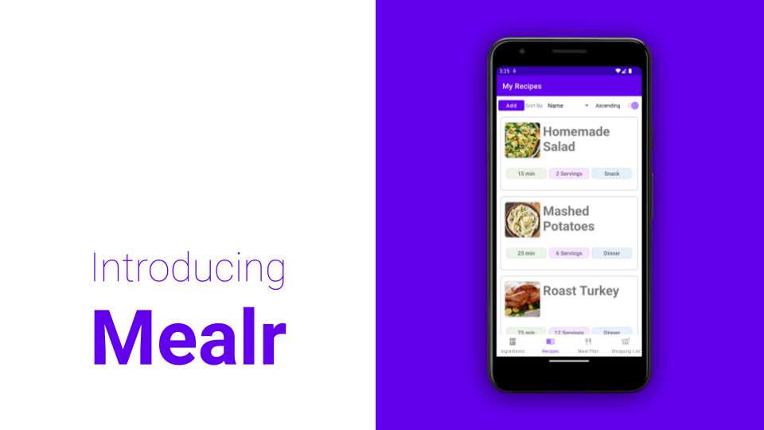
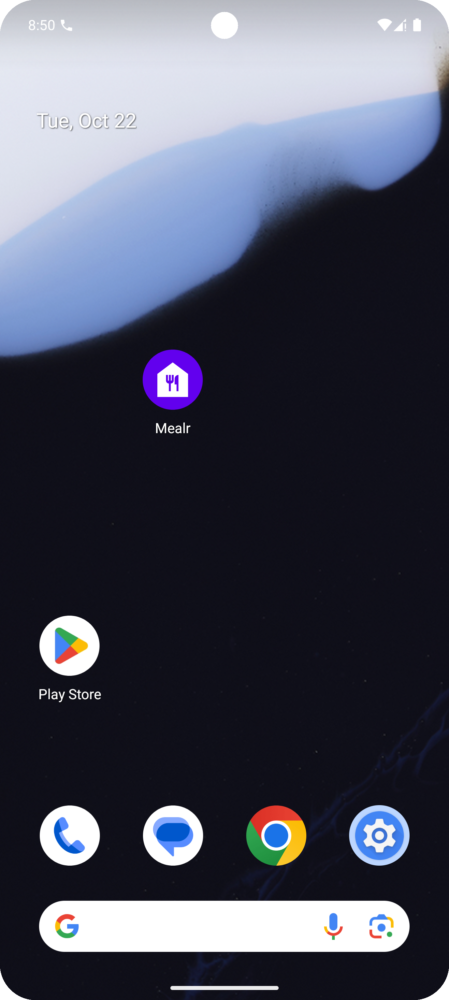
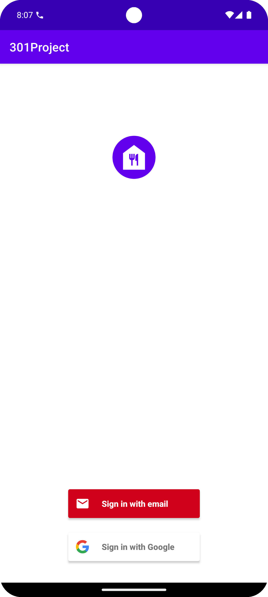
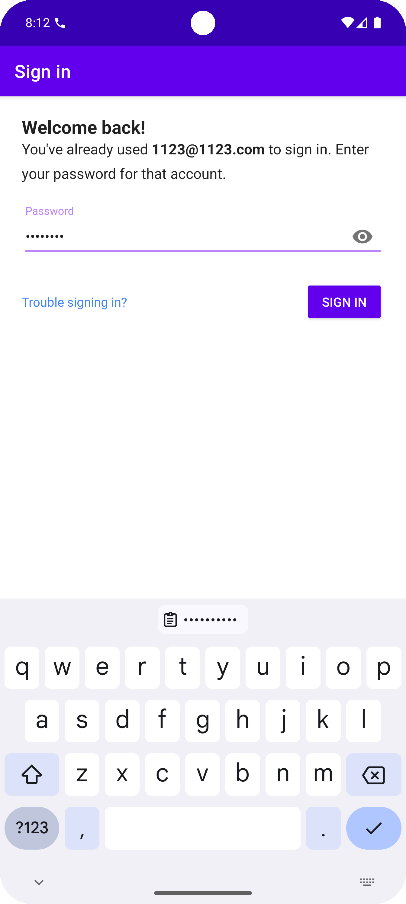

# Mealr app



## Project Overview

Mealer is an ingredient and recipe management app on the Android platform, designed to help users track ingredient inventory, manage recipes, and generate shopping lists. The app aims to improve household ingredient management efficiency, reduce waste, and simplify the shopping experience.

## Features

- **Ingredient Management**: Users can add, edit, and delete ingredient information, including name, quantity, location, unit, category, and expiration date.
- **Recipe Management**: Users can manage recipe information, link ingredients and steps, making it convenient for later reference and use.
- **Shopping List**: Generates a shopping list based on ingredient inventory, helping users check necessary items while shopping.
- **Sorting and Filtering**: Supports sorting ingredients by name, location, expiration date, and category for quick access.
- **Firebase Real-Time Database**: Backend support based on Firebase for data storage and synchronization (optional).

## Tech Stack

- **Frontend**: Java
- **Backend**: Firebase Firestore (optional)
- **Development Environment**: Android Studio

## Project Architecture

The project follows the `MVC` (Model-View-Controller) architecture pattern for better modularity and code maintainability. The main modules include:

- **Controllers**: Handle business logic and database interactions, such as `IngredientController` and `RecipeController`.
- **Fragments**: Responsible for user interface display and user interaction logic, such as `IngredientFragment` and `RecipeFragment`.
- **Adapters**: Adapt list data for the interface, such as `ShoppingListAdapter` and `RecipeIngredientListAdapter`.

## ShoppingList Module Example

Using the ShoppingList as an example, we provide a brief overview of its architecture and functions:

### 1. ShoppingItem:

Represents a single item in the shopping list, including fields such as name, quantity, unit, and category. It serves as the data model encapsulating detailed information for each shopping item.

### 2. ShoppingListAdapter:

Maps ShoppingItem data to UI components (such as TextView) for displaying shopping items in a ListView. The adapter also handles list item interactions, such as the "Purchased" button click event, and uses an interface to pass user actions to the controller layer.

### 3. ShoppingListController:

The business controller for the shopping list module, responsible for data interactions with Firebase Firestore, including retrieving shopping list items, adding new items, and deleting purchased items. It ensures data synchronization with the UI by monitoring changes in Firebase data.

### 4. ShoppingListFragment:

The view layer of the shopping list page, responsible for initializing UI elements (such as sorting dropdowns and switches) and invoking the ShoppingListController to fetch and display data. Additionally, it handles user sorting choices and editing actions for shopping items.

## Main File Structure

```sh
android/
├── .idea/                       # Project configuration files
├── app/                         # Main application directory
│   ├── src/
│   │   ├── androidTest/         # Android UI tests
│   │   │   └── java/com/example/project
│   │   └── main/                # Main source code for the application
│       └── java/com/example/project
│           ├── AddEditIngredientController.java
│           ├── AddEditIngredientFragment.java
│           ├── AddEditMealPlanFragment.java
│           ├── AddEditRecipeController.java
│           ├── AddEditRecipeFragment.java
│           ├── CustomList.java
│           ├── ...             # Other Java files omitted
│           ├── RecipeListAdapter.java
│           ├── ShoppingItem.java
│           ├── ShoppingListAdapter.java
│           └── ShoppingListFragment.java
│   └── res/                     # Resource files
│       ├── anim/                # Animation resources
│       │   ├── fade_in.xml
│       │   └── ...              # Other animation files omitted
│       ├── drawable/            # Image and icon resources
│       │   ├── app_icon.xml
│       │   └── ...
│       ├── layout/              # Layout files defining UI structure
│       │   ├── activity_ingredient.xml
│       │   └── ...
│       ├── values/              # Common resources like colors and strings
│       │   ├── colors.xml
│       │   └── ...
│       └── xml/                 # Additional XML configuration files
│           ├── backup_rules.xml
│           └── ...
│   └── AndroidManifest.xml       # Application configuration file
│   └── ic_launcher-playstore.png # Application icon
│   └── test/java/com/example/a301project
├── .gitignore                    # Git ignore file
├── build.gradle                  # Project build script
├── google-services.json          # Firebase configuration file
├── proguard-rules.pro            # ProGuard obfuscation configuration
└── gradle/wrapper                # Gradle wrapper files
    ├── ...
doc/
└── team.txt                      # Team information document
```

## Project Setup

1. **Clone the Project**: Clone the project to your local machine.

2. **Configure Firebase (Optional)**: Create a project in the Firebase console and add the Firebase configuration file in `google-services.json` to enable real-time database functionality.

3. **Import Project into Android Studio**:

   - Open Android Studio and select **"Open an Existing Project"**.
   - Navigate to the cloned project folder, select the `android/301Project` directory, and click **"OK"**.

4. **Sync the Project**:

   - Once the project is open, Android Studio will prompt you to sync Gradle. Click the **"Sync Now"** button to ensure all dependencies are correctly downloaded and configured.
   - **Note**: This project uses Gradle version **7.3.1**. If you encounter prompts to update the Gradle plugin, it's recommended to keep this version to avoid compatibility issues.

5. **Run a Virtual Device (Optional)**:

   - In Android Studio, open the **"Device Manager"**.
   - Click **"Create Device"** and select a simulator configuration (e.g., Pixel 5, API 31).
   - Download and install the appropriate system image if it is not already installed.
   - Start the virtual device to ensure it's running and ready to receive the app.

6. **Run the Project**:
   - Make sure the virtual device or a physical device is connected.
   - Click the **"Run"** button, select the target device, and Android Studio will compile and install the app.
   - Once installed successfully, the app will automatically launch on the device.

**Tip**: If you encounter Firebase or network issues, you can use local test data to replace real-time database functionality.

7. **Successful Run**: After the app is successfully installed, locate the "Mealer" app icon on the home screen of the virtual or physical device, as shown below. Click the icon to open the app, where you will see the login screen. New users can choose to register with an email or use Google for quick login, as shown in the images below.

<div style="display: flex; align-items: center; justify-content: space-around;">
    <div style="text-align: center;">
        <p>Home Screen Icon:</p>
        
    </div>
    <div style="text-align: center;">
        <p>App Login Screen:</p>
        
    </div>
    <div style="text-align: center;">
        <p>New User Registration with Email:</p>
        
    </div>
</div>

After completing registration or logging in with Google, new users can access all app features.

## Local Testing

If Firebase is not being used, you can use local data for testing. Here’s the code snippet:

```java
private void mockData() {
    dataList.add(new Ingredient("Sugar", 2.0, "2024-12-31", "Pantry", "Kg", "Food"));
    dataList.add(new Ingredient("Milk", 1.0, "2024-11-15", "Refrigerator", "L", "Dairy"));
    dataList.add(new Ingredient("Apples", 5.0, "2024-10-30", "Counter", "Unit", "Fruit"));
}
```

## Developers

wiskel
juyi
Zhiyuan
psabharw
kluge
yismail
